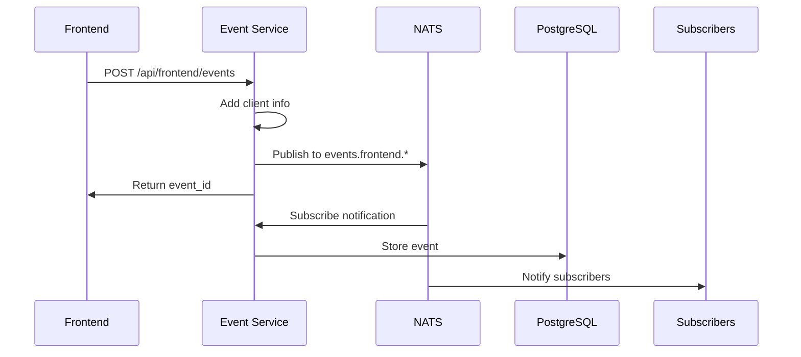
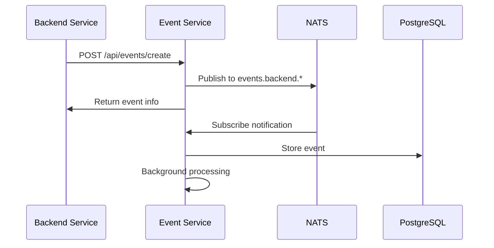

# Event Service 架构设计指南

## 架构概述

Event Service 基于Event Sourcing和CQRS模式，实现了高性能、可扩展的事件驱动架构。

## 核心架构图

```
┌─────────────────┐    ┌─────────────────┐    ┌─────────────────┐
│   Frontend      │    │   Backend       │    │   Other         │
│   Applications  │    │   Services      │    │   Services      │
└─────────┬───────┘    └─────────┬───────┘    └─────────┬───────┘
          │                      │                      │
          │ HTTP POST            │ HTTP POST            │ NATS Sub
          │                      │                      │
          ▼                      ▼                      ▼
    ┌─────────────────────────────────────────────────────────────┐
    │                 Event Service                                │
    │  ┌─────────────┐  ┌─────────────┐  ┌─────────────────────┐  │
    │  │ Frontend    │  │ Backend     │  │ NATS Subscriber     │  │
    │  │ Collection  │  │ Events API  │  │ Handler             │  │
    │  │ API         │  │             │  │                     │  │
    │  └─────────────┘  └─────────────┘  └─────────────────────┘  │
    └───────────────────────┬─────────────────────────────────────┘
                           │
                           ▼
    ┌─────────────────────────────────────────────────────────────┐
    │                NATS JetStream                               │
    │  ┌─────────────────────────────────────────────────────┐    │
    │  │               EVENTS Stream                         │    │
    │  │  events.frontend.user_interaction.*                 │    │
    │  │  events.frontend.business_action.*                  │    │
    │  │  events.frontend.system_event.*                     │    │
    │  │  events.backend.service.*                           │    │
    │  └─────────────────────────────────────────────────────┘    │
    └───────────────────────┬─────────────────────────────────────┘
                           │
                           ▼
    ┌─────────────────────────────────────────────────────────────┐
    │              Event Storage & Processing                     │
    │  ┌─────────────┐  ┌─────────────┐  ┌─────────────────────┐  │
    │  │ PostgreSQL  │  │ Event       │  │ Background          │  │
    │  │ Storage     │  │ Repository  │  │ Processors          │  │
    │  │             │  │             │  │                     │  │
    │  └─────────────┘  └─────────────┘  └─────────────────────┘  │
    └─────────────────────────────────────────────────────────────┘
```

## 核心组件详解

### 1. Event Collection Layer (事件采集层)

#### Frontend Collection API
- **路径**: `/api/frontend/events`
- **功能**: 采集前端用户行为、业务操作、系统事件
- **特性**: 
  - 支持单个和批量事件
  - 自动添加客户端信息
  - 离线事件缓存支持

#### Backend Events API  
- **路径**: `/api/events/create`
- **功能**: 微服务间的事件通信
- **特性**:
  - 结构化事件模型
  - 事件状态管理
  - 异步处理

### 2. Event Stream Layer (事件流层)

#### NATS JetStream
- **作用**: 事件的权威来源和分发中心
- **配置**:
  ```python
  Stream: EVENTS
  Subjects: events.>
  Retention: limits
  Max Messages: 1,000,000
  Max Age: 30 days
  ```

#### Subject Organization
```
events.{source}.{category}.{event_type}

Examples:
- events.frontend.user_interaction.page_view
- events.frontend.business_action.purchase_completed
- events.backend.service.user_created
```

### 3. Event Processing Layer (事件处理层)

#### Event Repository
- **数据库**: PostgreSQL with JSONB
- **表结构**:
  ```sql
  CREATE TABLE events (
    event_id UUID PRIMARY KEY,
    event_type VARCHAR(100) NOT NULL,
    event_source VARCHAR(50) NOT NULL,
    event_category VARCHAR(50) NOT NULL,
    user_id VARCHAR(100),
    session_id VARCHAR(100),
    data JSONB,
    metadata JSONB,
    status VARCHAR(20) DEFAULT 'pending',
    timestamp TIMESTAMP WITH TIME ZONE,
    created_at TIMESTAMP WITH TIME ZONE DEFAULT NOW()
  );
  ```

#### Background Processors
- **事件处理**: 异步处理待处理事件
- **状态更新**: pending → processing → completed/failed
- **重试机制**: 失败事件自动重试

## 设计模式

### 1. Event Sourcing

**核心原则**: 事件是系统状态的唯一来源

```python
# 事件流作为真相源
Event Stream (NATS) → Event Store (PostgreSQL) → Derived Views
```

**优势**:
- 完整的审计日志
- 时间点查询能力
- 事件重放功能
- 高度解耦

### 2. CQRS (Command Query Responsibility Segregation)

**写入路径** (Command):
```
API Request → Event Creation → NATS Publish → Storage
```

**查询路径** (Query):
```
Query API → PostgreSQL → Optimized Views
```

### 3. Pub/Sub Pattern

**发布者**:
- Frontend Applications
- Backend Services
- System Components

**订阅者**:
- Event Service (存储)
- Notification Service
- Analytics Service
- Audit Service

## 数据流详解

### 1. Frontend Event Flow



### 2. Backend Event Flow



## 扩展性设计

### 1. 水平扩展

**Event Service 集群**:
```
Load Balancer → Multiple Event Service Instances → Shared NATS/DB
```

**配置要点**:
- 无状态服务设计
- 共享NATS连接池
- 数据库连接池管理

### 2. 分片策略

**按用户分片**:
```python
shard_key = hash(user_id) % num_shards
topic = f"events.shard_{shard_key}.{category}.{event_type}"
```

**按时间分片**:
```python
date_key = datetime.now().strftime("%Y%m")
topic = f"events.{date_key}.{category}.{event_type}"
```

### 3. 存储优化

**分区表**:
```sql
-- 按月分区
CREATE TABLE events_202501 PARTITION OF events
FOR VALUES FROM ('2025-01-01') TO ('2025-02-01');
```

**索引策略**:
```sql
-- 查询优化索引
CREATE INDEX idx_events_user_time ON events(user_id, created_at);
CREATE INDEX idx_events_type_time ON events(event_type, created_at);
CREATE INDEX idx_events_source_time ON events(event_source, created_at);

-- JSONB数据索引
CREATE INDEX idx_events_data_gin ON events USING GIN(data);
```

## 性能优化

### 1. 批量处理

**前端批量**:
- 客户端事件缓存
- 定时批量发送
- 网络故障重试

**后端批量**:
- NATS批量确认
- 数据库批量插入
- 异步处理队列

### 2. 缓存策略

**Redis缓存**:
```python
# 热点事件类型缓存
cache_key = f"event_stats:{event_type}:{date}"
redis.setex(cache_key, 3600, stats_data)

# 用户会话缓存
session_key = f"session:{session_id}"
redis.setex(session_key, 1800, session_data)
```

### 3. 数据库优化

**连接池**:
```python
# SQLAlchemy配置
engine = create_engine(
    DATABASE_URL,
    pool_size=20,
    max_overflow=30,
    pool_pre_ping=True,
    pool_recycle=3600
)
```

**查询优化**:
```python
# 避免N+1查询
events = session.query(Event)\
    .filter(Event.user_id == user_id)\
    .options(selectinload(Event.related_data))\
    .all()
```

## 监控和观测

### 1. 关键指标

**性能指标**:
- 事件处理延迟 (P50, P95, P99)
- 吞吐量 (events/second)
- 错误率 (%)
- NATS连接状态

**业务指标**:
- 事件类型分布
- 用户活跃度
- 会话持续时间
- 转化漏斗

### 2. 日志结构

```python
{
  "timestamp": "2025-09-28T04:11:59.929Z",
  "level": "INFO",
  "service": "event-service",
  "event_id": "0fa7e146-c28f-47ff-a86b-abd77ebeb5e7",
  "event_type": "page_view",
  "user_id": "user123",
  "processing_time_ms": 45,
  "status": "completed"
}
```

### 3. 告警规则

```yaml
alerts:
  - name: "High Event Processing Latency"
    condition: "avg(event_processing_time) > 1000ms"
    action: "notify_oncall"
  
  - name: "NATS Connection Lost"
    condition: "nats_connected == false"
    action: "restart_service"
  
  - name: "High Error Rate"
    condition: "error_rate > 5%"
    action: "escalate"
```

## 安全考虑

### 1. 数据隐私

**敏感数据处理**:
```python
# 自动过滤敏感字段
SENSITIVE_FIELDS = ['password', 'ssn', 'credit_card']

def sanitize_event_data(data):
    for field in SENSITIVE_FIELDS:
        if field in data:
            data[field] = "[REDACTED]"
    return data
```

### 2. 访问控制

**API认证**:
```python
# JWT Token验证
@app.middleware("http")
async def verify_token(request: Request, call_next):
    if request.url.path.startswith("/api/"):
        token = request.headers.get("Authorization")
        if not verify_jwt_token(token):
            return JSONResponse({"error": "Unauthorized"}, 401)
    return await call_next(request)
```

### 3. 数据加密

**传输加密**: HTTPS/TLS
**存储加密**: PostgreSQL加密字段
**NATS加密**: TLS连接

## 容灾设计

### 1. 高可用性

**多副本部署**:
```
Primary Region: Event Service + NATS + PostgreSQL
Secondary Region: Event Service + NATS + PostgreSQL (read-replica)
```

### 2. 数据备份

**实时备份**:
- NATS消息持久化
- PostgreSQL主从复制
- 定期全量备份

### 3. 故障恢复

**自动故障转移**:
```python
# 健康检查
@app.get("/health")
async def health_check():
    checks = {
        "nats": check_nats_connection(),
        "database": check_database_connection(),
        "disk_space": check_disk_space()
    }
    
    if all(checks.values()):
        return {"status": "healthy", "checks": checks}
    else:
        raise HTTPException(503, {"status": "unhealthy", "checks": checks})
```

这个架构指南基于我们成功实现和测试的Event Service，提供了完整的技术架构和实施细节。