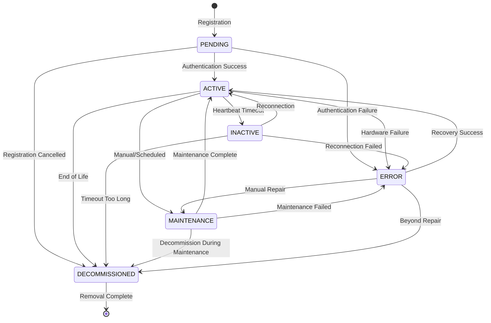
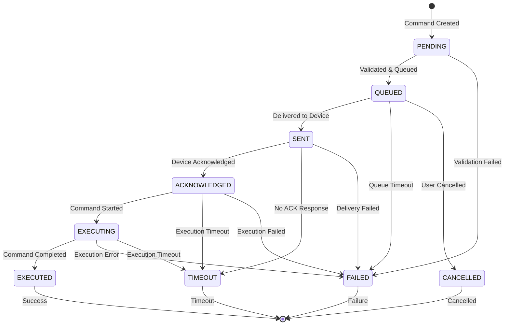
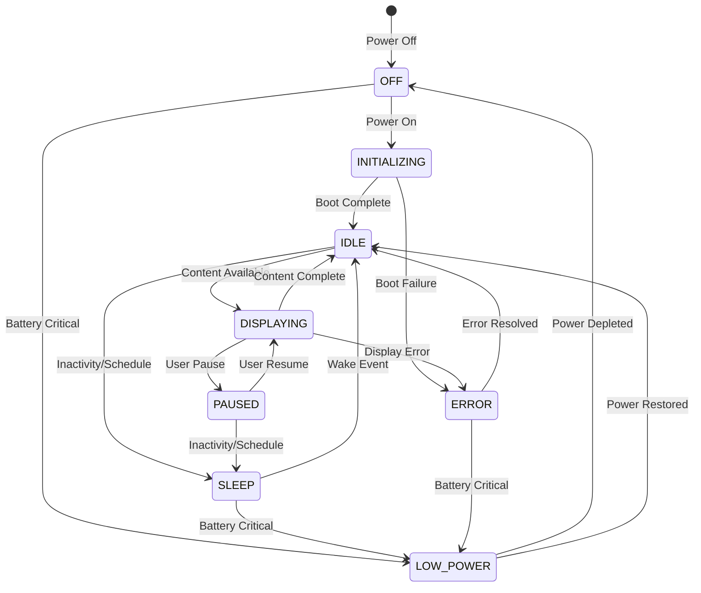

i# Device Service Logic Contract

This document defines the complete business logic contract for the Device Service, including business rules, state machines, validation logic, and edge case handling. All rules are designed to be testable and enforceable through code.

## Business Rules

### Device Registration Rules

#### REG-001: Unique Device Identity
- **Rule**: Each device must have a globally unique device ID
- **Implementation**: Generate SHA-256 hash of serial_number:mac_address:timestamp
- **Validation**: Ensure no existing device with same serial number and manufacturer
- **Error**: DUPLICATE_DEVICE_SERIAL
- **Test Cases**:
  - Valid: New serial number + manufacturer combination
  - Invalid: Duplicate serial number for same manufacturer
  - Edge: Same serial number, different manufacturer (allowed with different device_id)

#### REG-002: Approved Manufacturer Validation
- **Rule**: Only manufacturers from approved catalog can register devices
- **Implementation**: Validate against device_manufacturer catalog
- **Dynamic**: Allow admin to add/remove manufacturers
- **Error**: UNAPPROVED_MANUFACTURER
- **Test Cases**:
  - Valid: "Apple", "Google", "Samsung", "Generic"
  - Invalid: "UnknownBrand", "FakeCompany"
  - Edge: Case-insensitive matching

#### REG-003: Device Type Compatibility
- **Rule**: Device type must be compatible with manufacturer and model
- **Implementation**: Validation matrix of manufacturer -> supported_device_types
- **Error**: INCOMPATIBLE_DEVICE_TYPE
- **Test Cases**:
  - Valid: Apple -> iPhone (smart_phone), Samsung -> Galaxy (smart_phone)
  - Invalid: Apple -> Industrial Sensor
  - Edge: Generic manufacturer supports all types

#### REG-004: Security Level Enforcement
- **Rule**: Security level must meet minimum requirements for device type
- **Implementation**: Security level matrix per device_type
- **Matrix**:
  - CRITICAL: Medical, Industrial, Automotive
  - HIGH: Smart Frame, Camera, Controller
  - STANDARD: Sensor, Actuator, Gateway
  - BASIC: Smart Home, Wearable
  - NONE: Development/Testing only
- **Error**: INSUFFICIENT_SECURITY_LEVEL
- **Test Cases**:
  - Valid: Medical device with CRITICAL security
  - Invalid: Medical device with BASIC security
  - Edge: Admin can override with explicit approval

#### REG-005: Network Connectivity Requirements
- **Rule**: Device must have connectivity method compatible with type
- **Implementation**: Required connectivity per device_type
- **Requirements**:
  - SMART_FRAME: WIFI required, ETHERNET optional
  - MEDICAL: ETHERNET or CELLULAR_5G required
  - INDUSTRIAL: ETHERNET required, wired backup preferred
  - WEARABLE: BLUETOOTH required
- **Error**: INCOMPATIBLE_CONNECTIVITY
- **Test Cases**:
  - Valid: Smart Frame with WIFI
  - Invalid: Medical device with BLUETOOTH only
  - Edge: Multi-connectivity devices

### Device Authentication Rules

#### AUTH-001: Credential Validation
- **Rule**: Device must present valid credentials matching security level
- **Implementation**: Multi-method validation based on security_level
- **Methods**:
  - CRITICAL: Certificate + Device Secret
  - HIGH: Certificate or Device Secret + MFA
  - STANDARD: Device Secret
  - BASIC: Device Secret (weaker encryption)
  - NONE: No authentication (development only)
- **Error**: INVALID_CREDENTIALS, INSUFFICIENT_AUTH_METHOD
- **Test Cases**:
  - Valid: Certificate for CRITICAL level
  - Invalid: Secret only for CRITICAL level
  - Edge: Token authentication with valid certificate

#### AUTH-002: Certificate Chain Validation
- **Rule**: Certificates must chain to trusted root CA
- **Implementation**: X.509 certificate validation
- **Checks**:
  - Certificate not expired
  - Certificate not revoked (CRL check)
  - Certificate chains to trusted root
  - Certificate CN matches device_id or manufacturer
- **Error**: CERTIFICATE_INVALID, CERTIFICATE_EXPIRED, CERTIFICATE_REVOKED
- **Test Cases**:
  - Valid: Valid certificate from trusted CA
  - Invalid: Self-signed certificate
  - Edge: Certificate from intermediate CA

#### AUTH-003: Rate Limiting
- **Rule**: Authentication attempts limited per device and IP
- **Implementation**: Exponential backoff with circuit breaker
- **Limits**:
  - 5 attempts per minute per device
  - 20 attempts per minute per IP
  - 100 attempts per hour per account
- **Penalty**: Exponential backoff: 2^n seconds for n failures
- **Error**: RATE_LIMIT_EXCEEDED
- **Test Cases**:
  - Valid: Normal authentication flow
  - Invalid: Rapid authentication attempts
  - Edge: Distributed authentication attempts

#### AUTH-004: Device Fingerprinting
- **Rule**: Device must present consistent hardware fingerprint
- **Implementation**: Hash of hardware characteristics
- **Fingerprint Components**:
  - MAC address hash
  - Hardware version
  - Serial number pattern
  - Manufacturer identifier
- **Validation**: Fingerprint must match registration data within tolerance
- **Error**: DEVICE_FINGERPRINT_MISMATCH
- **Test Cases**:
  - Valid: Consistent fingerprint
  - Invalid: Changed MAC address
  - Edge: Firmware update changes some components

### Device State Management Rules

#### STATE-001: Status Transition Validity
- **Rule**: Device status must follow valid transition paths
- **State Machine**: See Device State Machine section
- **Valid Transitions**:
  - PENDING -> ACTIVE (after successful auth)
  - PENDING -> ERROR (auth failure)
  - ACTIVE -> INACTIVE (timeout/no activity)
  - ACTIVE -> MAINTENANCE (manual or scheduled)
  - ACTIVE -> ERROR (hardware failure)
  - INACTIVE -> ACTIVE (reconnect)
  - MAINTENANCE -> ACTIVE (maintenance complete)
  - ERROR -> ACTIVE (recovery)
  - ERROR -> MAINTENANCE (manual repair)
  - * -> DECOMMISSIONED (end of life)
- **Error**: INVALID_STATUS_TRANSITION
- **Test Cases**:
  - Valid: PENDING -> ACTIVE after auth
  - Invalid: PENDING -> DECOMMISSIONED without ERROR
  - Edge: ERROR -> ACTIVE after auto-recovery

#### STATE-002: Heartbeat Requirements
- **Rule**: Devices must send heartbeat within configured interval
- **Implementation**: Configurable heartbeat per device type
- **Intervals**:
  - SMART_FRAME: 5 minutes
  - MEDICAL: 1 minute
  - INDUSTRIAL: 30 seconds
  - SENSOR: 10 minutes
  - WEARABLE: 15 minutes
- **Timeout**: 3x heartbeat interval triggers INACTIVE status
- **Error**: DEVICE_TIMEOUT
- **Test Cases**:
  - Valid: Regular heartbeats
  - Invalid: Missing heartbeats
  - Edge: Intermittent connectivity

#### STATE-003: Health Score Calculation
- **Rule**: Health score calculated from multiple weighted factors
- **Implementation**: Algorithmic health scoring (0-100)
- **Factors**:
  - Uptime percentage (30% weight)
  - Command success rate (25% weight)
  - Resource utilization (20% weight)
  - Error frequency (15% weight)
  - Response latency (10% weight)
- **Formula**: `health_score = Σ(factor_weight * factor_score)`
- **Thresholds**:
  - HEALTHY: >= 80
  - WARNING: 60-79
  - CRITICAL: < 60
- **Test Cases**:
  - Valid: All factors within normal range
  - Warning: One factor degraded
  - Critical: Multiple factors poor

### Device Command Rules

#### CMD-001: Command Authorization
- **Rule**: Users can only send commands to devices they own or have access to
- **Implementation**: Permission matrix validation
- **Permission Levels**:
  - OWNER: Full control
  - FAMILY_MEMBER: View + Control (if permitted)
  - SHARED_USER: View only
  - SERVICE_ACCOUNT: Configurable per service
- **Error**: UNAUTHORIZED_COMMAND_ACCESS
- **Test Cases**:
  - Valid: Device owner sends reboot command
  - Invalid: Random user sends command
  - Edge: Family member with limited permissions

#### CMD-002: Command Type Validation
- **Rule**: Commands must be supported by device type
- **Implementation**: Device capability matrix
- **Supported Commands by Type**:
  - SMART_FRAME: display_control, sync_content, reboot, update_config
  - SENSOR: read_data, calibrate, set_interval
  - CAMERA: capture_photo, start_recording, stop_recording
  - ACTUATOR: activate, deactivate, set_value
  - MEDICAL: read_vitals, configure_alerts, emergency_stop
- **Error**: UNSUPPORTED_COMMAND
- **Test Cases**:
  - Valid: capture_photo on camera
  - Invalid: display_control on sensor
  - Edge: Generic commands on custom devices

#### CMD-003: Parameter Validation
- **Rule**: Command parameters must match command schema
- **Implementation**: JSON schema validation per command type
- **Validation Rules**:
  - Required parameters present
  - Parameter types correct
  - Parameter values within valid ranges
  - No unknown parameters
- **Error**: INVALID_COMMAND_PARAMETERS
- **Test Cases**:
  - Valid: Correct parameters for command
  - Invalid: Missing required parameter
  - Edge: Parameter at boundary value

#### CMD-004: Priority and Queue Management
- **Rule**: Commands executed based on priority and resource availability
- **Implementation**: Priority queue with resource constraints
- **Priority Levels**: 1 (lowest) to 10 (highest)
- **Queue Behavior**:
  - Higher priority commands pre-empt lower priority
  - Same priority: FIFO order
  - Resource constraints may delay execution
  - Timeout: Commands expire after timeout period
- **Error**: COMMAND_TIMEOUT, RESOURCE_UNAVAILABLE
- **Test Cases**:
  - Valid: Emergency command with priority 10
  - Normal: Regular command with priority 5
  - Edge: Queue full, command rejected

#### CMD-005: Command Acknowledgment
- **Rule**: Commands requiring ACK must receive confirmation within timeout
- **Implementation**: ACK tracking with timeout handling
- **ACK Requirements**:
  - require_ack=true commands must be acknowledged
  - ACK timeout: 30 seconds default, configurable per command
  - No ACK: Command marked as FAILED
  - Retry: Automatic retry for network issues
- **Error**: COMMAND_ACK_TIMEOUT
- **Test Cases**:
  - Valid: Device sends ACK within timeout
  - Invalid: No ACK received
  - Edge: Late ACK after timeout

### Smart Frame Specific Rules

#### FRAME-001: Content Appropriateness
- **Rule**: Content displayed must be appropriate for device capabilities
- **Implementation**: Content validation and transcoding
- **Validation Rules**:
  - Resolution match or scaling capability
  - Format support (jpg, png, mp4 supported)
  - File size limits per storage capacity
  - Content rating filters (if enabled)
- **Error**: UNSUPPORTED_CONTENT, CONTENT_TOO_LARGE
- **Test Cases**:
  - Valid: JPG within resolution limits
  - Invalid: 4K video on 720p frame
  - Edge: Borderline file sizes

#### FRAME-002: Sync Frequency Limits
- **Rule**: Sync frequency respects network and storage constraints
- **Implementation**: Rate limiting with adaptive scheduling
- **Limits**:
  - Real-time: Only on WiFi, power connected
  - Hourly: Default for most users
  - Daily: For low bandwidth connections
  - Manual: User initiated syncs
- **Adaptation**: Adjust based on network conditions and battery
- **Error**: SYNC_RATE_EXCEEDED, INSUFFICIENT_RESOURCES
- **Test Cases**:
  - Valid: Hourly sync on WiFi
  - Invalid: Real-time sync on cellular
  - Edge: Adaptive scheduling

#### FRAME-003: Display Configuration
- **Rule**: Display settings must be within device capabilities
- **Implementation**: Capability-based validation
- **Constraints**:
  - Brightness: 0-100% (device-specific max)
  - Contrast: 50-150% of default
  - Sleep schedule: Valid time format
  - Orientation: Supported orientations only
- **Error**: INVALID_DISPLAY_CONFIG
- **Test Cases**:
  - Valid: Brightness 80% within limits
  - Invalid: Brightness 150% exceeding max
  - Edge: Portrait vs landscape limitations

#### FRAME-004: Family Sharing Permissions
- **Rule**: Content sharing respects family organization permissions
- **Implementation**: Permission matrix with inheritance
- **Permission Levels**:
  - OWNER: Full control, sharing permissions
  - ADMIN: Control, user management
  - MEMBER: View, limited control
  - GUEST: View only
- **Content Access**:
  - Shared albums based on family permissions
  - Personal content always private to owner
  - Public content based on sharing settings
- **Error**: INSUFFICIENT_SHARING_PERMISSIONS
- **Test Cases**:
  - Valid: Owner shares family album
  - Invalid: Guest tries to modify settings
  - Edge: Complex permission inheritance

### Device Group Rules

#### GROUP-001: Group Hierarchy Validation
- **Rule**: Group hierarchy cannot contain cycles and respects depth limits
- **Implementation**: Tree validation with depth checking
- **Constraints**:
  - Maximum depth: 5 levels
  - No circular references
  - Parent must exist
  - Cannot be own ancestor
- **Error**: INVALID_GROUP_HIERARCHY, CIRCULAR_REFERENCE
- **Test Cases**:
  - Valid: Linear hierarchy within depth limit
  - Invalid: Group references itself as parent
  - Edge: Complex multi-level hierarchy

#### GROUP-002: Membership Constraints
- **Rule**: Device can belong to multiple groups with conflict resolution
- **Implementation**: Multi-membership with priority rules
- **Rules**:
  - Device can be in maximum 10 groups
  - Conflicting settings: Most specific group wins
  - Priority: Direct assignment > inherited > default
  - Group membership inherits from parent groups
- **Error**: TOO_MANY_GROUPS, CONFLICTING_MEMBERSHIP
- **Test Cases**:
  - Valid: Device in 3 compatible groups
  - Invalid: Device in 15 groups
  - Edge: Conflicting settings resolution

#### GROUP-003: Bulk Operation Limits
- **Rule**: Bulk operations limited by group size and system capacity
- **Implementation**: Resource-aware bulk processing
- **Limits**:
  - Max devices per bulk operation: 1000
  - Max concurrent bulk operations: 5
  - Rate limiting: 1 bulk operation per minute per group
  - Resource allocation: Fair sharing among users
- **Error**: BULK_OPERATION_TOO_LARGE, CONCURRENT_BULK_LIMIT
- **Test Cases**:
  - Valid: Bulk operation on 50 devices
  - Invalid: Bulk operation on 2000 devices
  - Edge: Multiple concurrent operations

## State Machines

### Device Lifecycle State Machine



#### State Descriptions
- **PENDING**: Device registered but not yet authenticated
- **ACTIVE**: Device online, authenticated, and operational
- **INACTIVE**: Device offline but not decommissioned
- **MAINTENANCE**: Device under maintenance, limited operations
- **ERROR**: Device in error state, needs attention
- **DECOMMISSIONED**: Device permanently removed from service

#### Transition Conditions
- **Authentication Success**: Valid credentials provided
- **Authentication Failure**: Invalid/expired credentials
- **Heartbeat Timeout**: No heartbeat for 3x interval
- **Reconnection**: Device reconnects after offline period
- **Manual/Scheduled**: Admin or scheduled maintenance
- **Hardware Failure**: Critical hardware malfunction
- **Recovery Success**: Error condition resolved
- **Manual Repair**: Physical repair required
- **Beyond Repair**: Device cannot be recovered

### Command Execution State Machine



#### State Descriptions
- **PENDING**: Command created and being validated
- **QUEUED**: Command validated and in execution queue
- **SENT**: Command delivered to device via MQTT
- **ACKNOWLEDGED**: Device confirmed receipt of command
- **EXECUTING**: Device is currently executing the command
- **EXECUTED**: Command completed successfully
- **FAILED**: Command failed due to error
- **TIMEOUT**: Command failed due to timeout
- **CANCELLED**: Command cancelled by user

### Smart Frame Display State Machine



## Validation Logic

### Input Validation Patterns

#### String Field Validation
```python
def validate_device_name(name: str) -> ValidationResult:
    """Validate device name format and content"""
    if not name or len(name.strip()) == 0:
        return ValidationResult(False, "DEVICE_NAME_EMPTY")
    
    if len(name) > 200:
        return ValidationResult(False, "DEVICE_NAME_TOO_LONG")
    
    # Check for forbidden characters
    forbidden_chars = ['<', '>', '"', "'", '&', 'script', 'javascript']
    if any(char in name.lower() for char in forbidden_chars):
        return ValidationResult(False, "DEVICE_NAME_INVALID_CHARS")
    
    return ValidationResult(True, "VALID")

def validate_serial_number(serial: str, manufacturer: str) -> ValidationResult:
    """Validate serial number format for manufacturer"""
    if not serial or len(serial.strip()) == 0:
        return ValidationResult(False, "SERIAL_NUMBER_EMPTY")
    
    # Manufacturer-specific validation
    patterns = {
        "Apple": r"^[A-Z0-9]{11,12}$",  # Apple format
        "Samsung": r"^[A-Z0-9]{12,15}$",  # Samsung format
        "Generic": r"^[A-Z0-9\-_]{8,20}$"  # Generic format
    }
    
    pattern = patterns.get(manufacturer, patterns["Generic"])
    if not re.match(pattern, serial.upper()):
        return ValidationResult(False, "SERIAL_NUMBER_INVALID_FORMAT")
    
    return ValidationResult(True, "VALID")
```

#### Numeric Field Validation
```python
def validate_percentage(value: int, field_name: str) -> ValidationResult:
    """Validate percentage fields (0-100)"""
    if not isinstance(value, int):
        return ValidationResult(False, f"{field_name}_NOT_INTEGER")
    
    if value < 0 or value > 100:
        return ValidationResult(False, f"{field_name}_OUT_OF_RANGE")
    
    return ValidationResult(True, "VALID")

def validate_timeout(timeout: int) -> ValidationResult:
    """Validate command timeout (1-300 seconds)"""
    if not isinstance(timeout, int):
        return ValidationResult(False, "TIMEOUT_NOT_INTEGER")
    
    if timeout < 1 or timeout > 300:
        return ValidationResult(False, "TIMEOUT_OUT_OF_RANGE")
    
    return ValidationResult(True, "VALID")
```

#### JSON Schema Validation
```python
def validate_command_parameters(command: str, parameters: dict) -> ValidationResult:
    """Validate command parameters against JSON schema"""
    schemas = {
        "display_control": {
            "type": "object",
            "properties": {
                "brightness": {"type": "integer", "minimum": 0, "maximum": 100},
                "mode": {"type": "string", "enum": ["photo", "video", "clock"]},
                "duration": {"type": "integer", "minimum": 1}
            },
            "required": ["brightness"]
        },
        "sync_content": {
            "type": "object",
            "properties": {
                "album_ids": {"type": "array", "items": {"type": "string"}},
                "force": {"type": "boolean"},
                "priority": {"type": "string", "enum": ["low", "normal", "high"]}
            },
            "required": ["album_ids"]
        }
    }
    
    schema = schemas.get(command)
    if not schema:
        return ValidationResult(False, "UNKNOWN_COMMAND_SCHEMA")
    
    try:
        jsonschema.validate(parameters, schema)
        return ValidationResult(True, "VALID")
    except jsonschema.ValidationError as e:
        return ValidationResult(False, f"INVALID_PARAMETERS: {e.message}")
```

### Business Logic Validation

#### Device Ownership Validation
```python
def validate_device_ownership(user_id: str, device_id: str) -> ValidationResult:
    """Validate user has permission to access device"""
    device = get_device(device_id)
    
    if not device:
        return ValidationResult(False, "DEVICE_NOT_FOUND")
    
    # Direct ownership
    if device.user_id == user_id:
        return ValidationResult(True, "OWNER_ACCESS")
    
    # Family sharing
    if device.organization_id:
        if check_family_membership(user_id, device.organization_id):
            permissions = get_family_permissions(user_id, device.organization_id)
            if "device_control" in permissions:
                return ValidationResult(True, "FAMILY_ACCESS")
    
    return ValidationResult(False, "UNAUTHORIZED_ACCESS")
```

#### Command Compatibility Validation
```python
def validate_command_compatibility(device_type: str, command: str) -> ValidationResult:
    """Validate command is supported by device type"""
    compatibility_matrix = {
        "smart_frame": {
            "supported_commands": [
                "display_control", "sync_content", "reboot", 
                "update_config", "get_status"
            ],
            "required_auth": ["secret_key", "certificate"]
        },
        "sensor": {
            "supported_commands": [
                "read_data", "set_interval", "calibrate", "reset"
            ],
            "required_auth": ["secret_key"]
        }
    }
    
    device_config = compatibility_matrix.get(device_type)
    if not device_config:
        return ValidationResult(False, "UNKNOWN_DEVICE_TYPE")
    
    if command not in device_config["supported_commands"]:
        return ValidationResult(False, "UNSUPPORTED_COMMAND")
    
    return ValidationResult(True, "VALID")
```

## Edge Case Handling

### Network Connectivity Edge Cases

#### Intermittent Connectivity
```python
class ConnectivityHandler:
    """Handle intermittent connectivity scenarios"""
    
    def handle_heartbeat_timeout(self, device_id: str):
        """Graceful degradation on heartbeat timeout"""
        # 1. Mark as potentially offline
        self.set_device_status(device_id, DeviceStatus.POTENTIALLY_OFFLINE)
        
        # 2. Start reconnection attempts
        self.initiate_reconnection_sequence(device_id)
        
        # 3. Buffer commands during uncertainty
        self.buffer_commands(device_id, max_buffer=10)
        
        # 4. Wait for grace period
        asyncio.sleep(60)  # 1 minute grace period
        
        # 5. Confirm offline status
        if not self.is_device_responsive(device_id):
            self.set_device_status(device_id, DeviceStatus.INACTIVE)
            self.flush_command_buffer(device_id, redirect=True)
```

#### Network Partition Recovery
```python
def handle_network_partition_recovery(self):
    """Handle recovery from network partition"""
    # 1. Reconcile device states
    offline_devices = self.get_devices_by_status(DeviceStatus.INACTIVE)
    
    # 2. Bulk status check
    for device in offline_devices:
        try:
            if self.ping_device(device.device_id):
                self.set_device_status(device.device_id, DeviceStatus.ACTIVE)
                self.flush_command_buffer(device.device_id)
        except NetworkError:
            continue  # Still offline
    
    # 3. Replay missed events
    self.replay_events_during_partition()
    
    # 4. Notify administrators
    self.notify_partition_recovery(len(offline_devices))
```

### Resource Constraint Edge Cases

#### Command Queue Overflow
```python
def handle_command_queue_overflow(self, device_id: str):
    """Handle scenario where command queue is full"""
    # 1. Prioritize commands
    commands = self.get_queued_commands(device_id)
    prioritized = self.prioritize_commands(commands)
    
    # 2. Drop low-priority commands
    high_priority = [cmd for cmd in prioritized if cmd.priority >= 7]
    dropped_commands = len(commands) - len(high_priority)
    
    if dropped_commands > 0:
        self.log_warning(f"Dropped {dropped_commands} low-priority commands for {device_id}")
        self.notify_command_dropped(device_id, dropped_commands)
    
    # 3. Implement backpressure
    self.set_device_backpressure(device_id, enabled=True)
    
    # 4. Temporarily reject new commands
    self.set_command_acceptance(device_id, accept="high_priority_only")
```

#### Storage Constraint Handling
```python
def handle_storage_constraints(self, device_id: str, required_storage: int):
    """Handle devices with limited storage"""
    device = get_device(device_id)
    available_storage = self.get_available_storage(device_id)
    
    if required_storage > available_storage:
        # 1. Cleanup old content
        self.cleanup_old_content(device_id, required_space=required_storage - available_storage)
        
        # 2. Compress content if possible
        if device.device_type == DeviceType.SMART_FRAME:
            self.compress_existing_content(device_id)
        
        # 3. Offer storage upgrade
        if device.organization_id:
            self.suggest_storage_upgrade(device.organization_id)
        
        # 4. Reject if still insufficient
        new_available = self.get_available_storage(device_id)
        if required_storage > new_available:
            raise InsufficientStorageError(f"Required: {required_storage}, Available: {new_available}")
```

### Security Edge Cases

#### Certificate Revocation Handling
```python
def handle_certificate_revocation(self, device_id: str, certificate_id: str):
    """Handle immediate certificate revocation"""
    # 1. Immediately invalidate device session
    self.revoke_device_session(device_id)
    
    # 2. Block device authentication
    self.block_device_authentication(device_id, reason="CERTIFICATE_REVOKED")
    
    # 3. Force device offline
    self.force_device_offline(device_id)
    
    # 4. Notify administrators
    self.notify_security_event(
        event_type="CERTIFICATE_REVOKED",
        device_id=device_id,
        certificate_id=certificate_id,
        severity="HIGH"
    )
    
    # 5. Require re-authentication with new certificate
    self.require_reauthentication(device_id, method="NEW_CERTIFICATE")
```

#### Brute Force Attack Detection
```python
def handle_authentication_abuse(self, device_id: str, source_ip: str):
    """Detect and handle brute force attacks"""
    auth_attempts = self.get_authentication_attempts(device_id, source_ip, window=300)  # 5 minutes
    
    if len(auth_attempts) > 10:  # More than 10 attempts in 5 minutes
        # 1. Rate limit aggressively
        self.set_rate_limit(source_ip, limit=1, window=900)  # 1 attempt per 15 minutes
        
        # 2. Block device temporarily
        self.block_device_temporarily(device_id, duration=1800)  # 30 minutes
        
        # 3. Alert security team
        self.notify_security_incident(
            incident_type="BRUTE_FORCE_ATTACK",
            device_id=device_id,
            source_ip=source_ip,
            attempts=len(auth_attempts),
            severity="CRITICAL"
        )
        
        # 4. Log all details for forensics
        self.log_security_event({
            "timestamp": datetime.utcnow(),
            "device_id": device_id,
            "source_ip": source_ip,
            "attempts": auth_attempts,
            "action": "BLOCKED"
        })
```

### Data Consistency Edge Cases

#### Concurrent Device Updates
```python
def handle_concurrent_updates(self, device_id: str, update_data: dict):
    """Handle concurrent updates to same device"""
    with self.device_update_lock(device_id, timeout=10):
        current_device = self.get_device(device_id)
        
        # Check version/ETag
        current_version = current_device.updated_at
        provided_version = update_data.get("version")
        
        if provided_version and provided_version != current_version:
            # Conflict detected
            conflict = self.resolve_update_conflict(
                current_data=current_device,
                new_data=update_data,
                strategy="last_write_wins"
            )
            return self.apply_update(device_id, conflict.resolved_data)
        else:
            return self.apply_update(device_id, update_data)
```

#### Event Ordering Guarantees
```python
def ensure_event_ordering(self, events: List[Event]):
    """Ensure events are processed in correct order"""
    # Sort events by timestamp and sequence number
    sorted_events = sorted(events, key=lambda e: (e.timestamp, e.sequence_number))
    
    # Detect gaps in sequence
    for i, event in enumerate(sorted_events):
        if i > 0:
            prev_event = sorted_events[i-1]
            if event.sequence_number > prev_event.sequence_number + 1:
                # Gap detected - wait for missing events
                self.wait_for_missing_events(
                    expected_sequence=prev_event.sequence_number + 1,
                    timeout=30
                )
    
    # Process events in order
    for event in sorted_events:
        self.process_event(event)
```

This logic contract provides comprehensive coverage of all business rules, state transitions, validation logic, and edge case handling required for robust device service operation. Each rule is designed to be independently testable and enforceable through code implementation.
